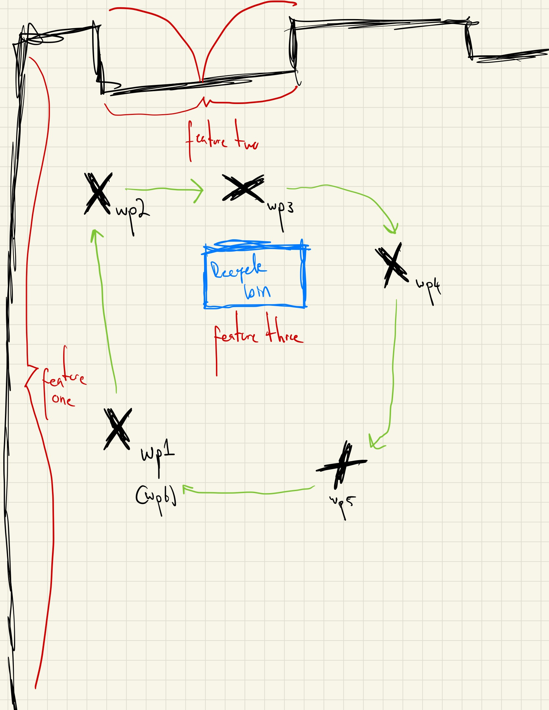
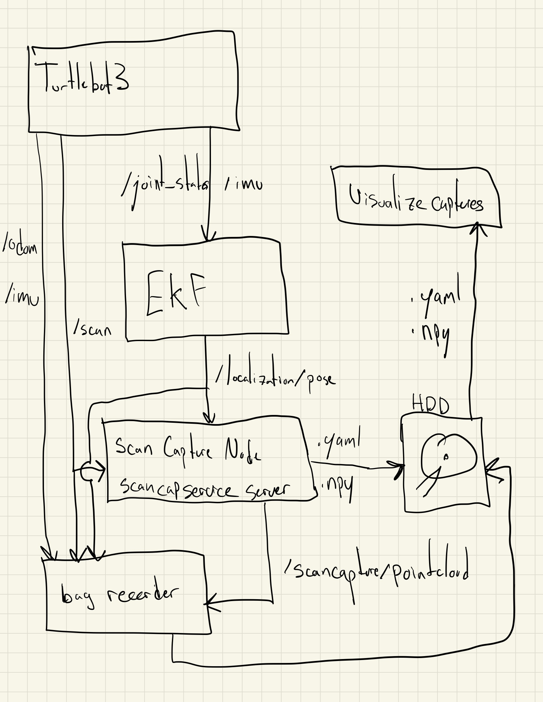
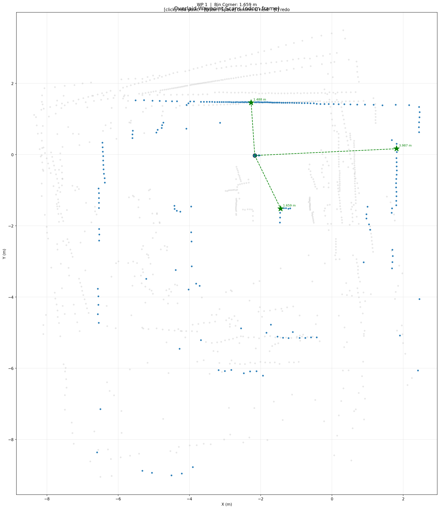
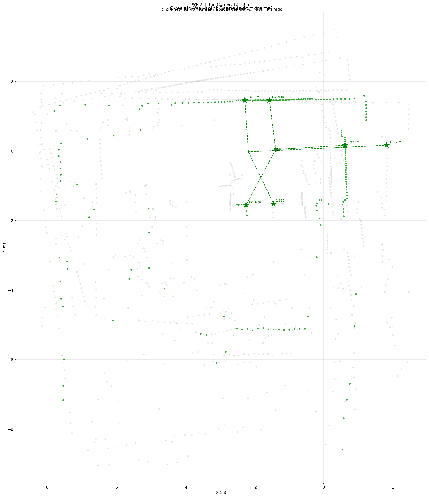
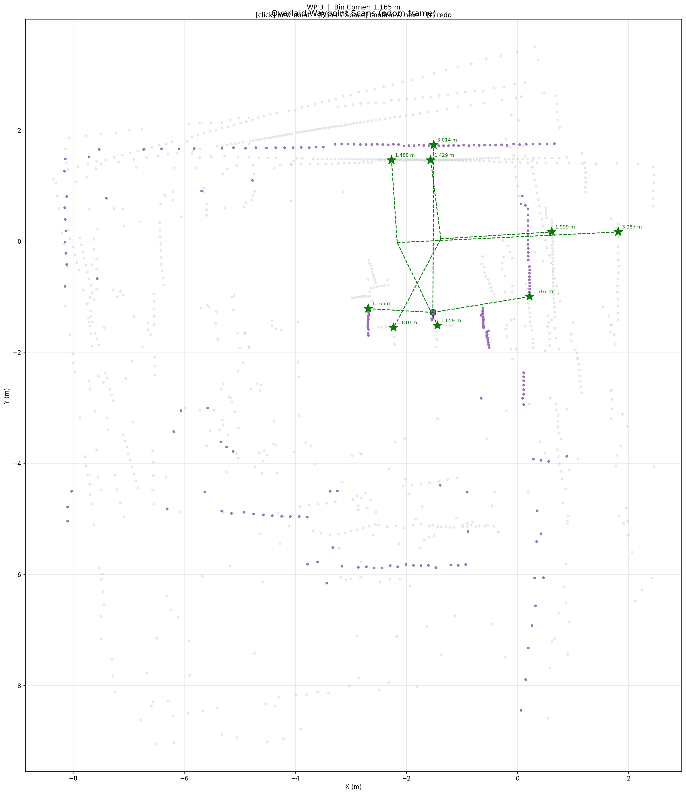
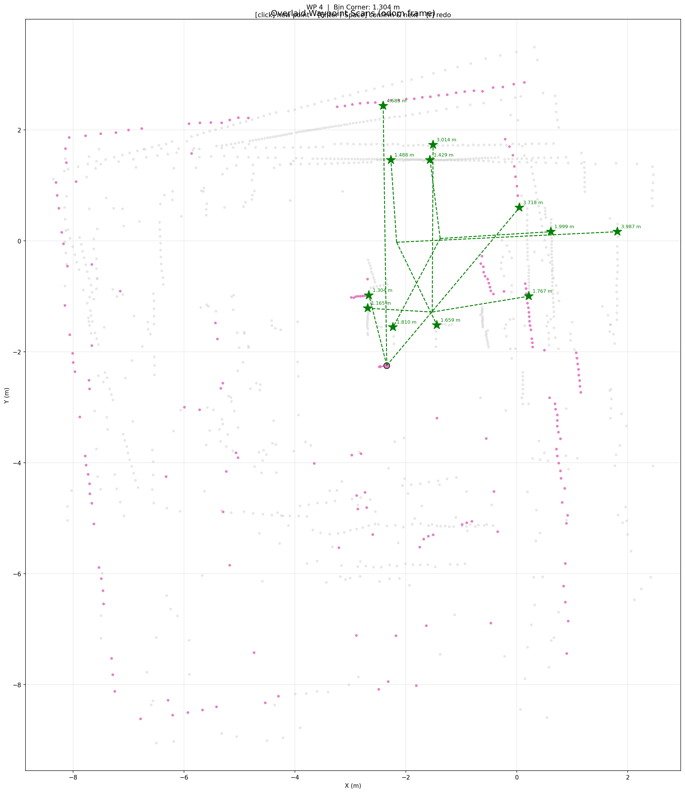
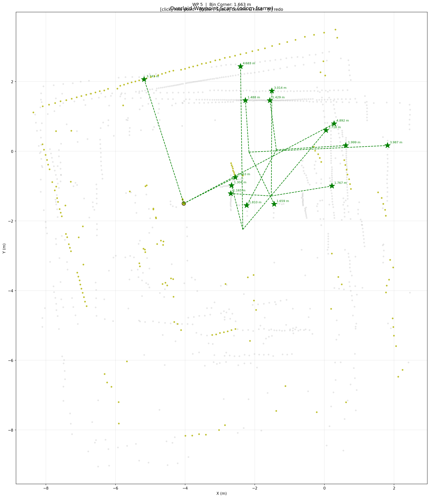
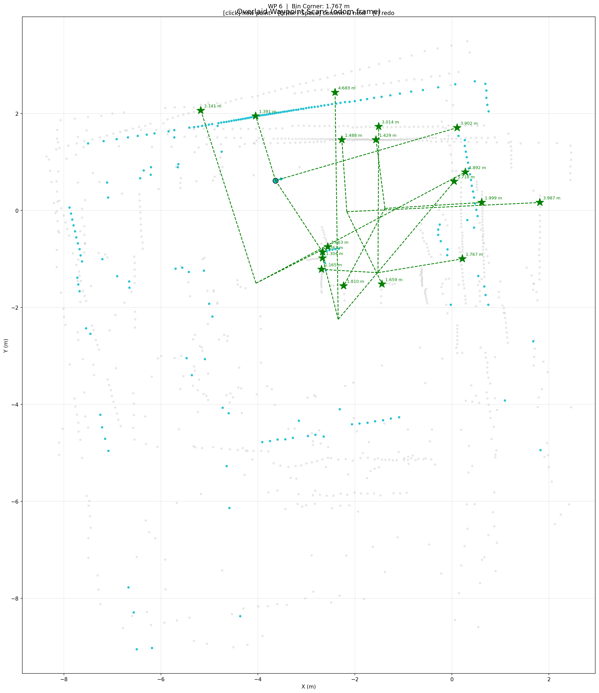

# Project 6: Naive Mapping by Waypoints

**EE5531 Introduction to Robotics**

**Team Members:** Anders Smitterberg, Victor Ameh

**Data collection date:** 2026-03-14

---

## 1. Navigation Strategy Summary (5 pts)

### Environment Description

The environment is a lab EERC 727 with a recycling bin placed in the center. The north wall runs along the top of the room, and a door is located in the east wall. The robot circled the recycling bin clockwise across five waypoints, then returned to the starting position for a sixth capture to check loop closure drift. From each waypoint the LDS has a clear line of sight to the north wall, the east door, and one corner of the recycling bin. At each waypoint, after taking the RViz screenshot and calling the scan capture service, a Leica laser rangefinder was used to measure the distance to the nearest visible corner of the recycling bin as the ground truth along with the shortest distance to the door and north wall.

### Environment Sketch



### Waypoint Summary

The robot circled the recycling bin clockwise across five waypoints, then returned to the start position where a sixth capture was taken for loop closure check. At each stop the procedure was: (1) take an RViz screenshot, (2) call the scan capture service, then (3) walk over and measure the distance to the nearest visible corner of the bin with the Leica laser rangefinder in addition to the walls. Poses are in the odometry frame (captured 2026-03-14).

| Capture | Odom X (m) | Odom Y (m) | Yaw (deg) | Approx. Heading | Notes                        |
|---------|------------|------------|---------|-----------------|------------------------------|
| WP 1    | −2.167     | −0.025     |  +1     | East            | Start position               |
| WP 2    | −1.382     | +0.043     |  +3     | East            |                              |
| WP 3    | −1.525     | −1.283     | −97     | South           |                              |
| WP 4    | −2.345     | −2.246     | −170    | West            |                              |
| WP 5    | −4.041     | −1.500     | +105    | North           |                              |
| WP 6    | −3.637     | +0.618     |  +16    | East            | Return to start (loop closure) |

For the full written strategy see [`docs/navigation_strategy.md`](docs/navigation_strategy.md).

---

## 2. System Architecture (5 pts)

### Data Flow Diagram



Bag file records `/scan`, `/odom`, `/imu`, `/localization/pose`, and `/scan_capture/pointcloud` for replay and analysis.

### EKF Configuration Summary

The EKF node (launched via `scan_capture_pkg/launch/localization.launch.py`) fuses:

| Source | Topic | Signals |
|--------|-------|---------|
| Wheel odometry | `/joint_states` | Linear velocity (x), angular velocity (z) |
| IMU | `/imu` | Angular velocity (z), linear acceleration |

The filter publishes a `geometry_msgs/PoseStamped` to `/localization/pose` at the scan frame. If the localization node is unavailable, `scan_capture_node` automatically falls back to raw odometry from `/odom` as per the assignment instructions.

### Project 5 Sensor Characterization Integration

If we were to integrate the model from Project 5 we would do it as follows. We determined that the performance of the LDS could be characterized by a gaussian distribution, and that the variance of that distribution increased approximately linearly with the distance of the measurement.

This could be used to asign a probability of a real object being at the location of each one of the measured points. This information could be used to better, and more accurately determine wether a return is actually an obstacle, or if it is sinply sensor noise before commiting it to the map. 

---

## 3. Map Accuracy Results (15 pts)

### Note on Map Measurement Method

The assignment instructions specify measuring distances using the RViz Measure tool after replaying the bag file, stating that the captured point clouds *"appear correctly in RViz during bag replay because TF provides the transform from the laser frame to `odom` at each capture timestamp."* However, the bag record command provided in the instructions does not include `/tf` or `/tf_static`:

```
ros2 bag record -o mapping_run /scan /odom /imu /localization/pose /scan_capture/pointcloud
```

Unfortunately because TF was not recorded, RViz cannot transform the captured point clouds (which are in the `base_scan` frame) into the `odom` fixed frame during playback. As a result, RViz only shows the TF axes and nothing else.

To work around this, map distances were measured using `analysis/visualize_captures.py --measure`, which reads the saved `.yaml` pose and `.npy` range files directly, transforms each scan into the odom frame using the recorded pose, and provides an interactive click-to-measure tool. Since the robot position at each waypoint is known exactly from the saved pose, the measurement is equivalent to what the RViz Measure tool would have provided.

### Distance Accuracy Table

Map distances were measured using `analysis/visualize_captures.py --measure` (see note above). The "Map (m)" column contains distances measured from the robot's saved odom position to the clicked landmark point in the transformed scan. Leica ground truth was measured immediately after each scan capture during the run. Three landmarks were measured at every waypoint: the **nearest visible corner of the recycling bin**, the **north wall**, and the **east door**.

#### Recycling Bin Corner

| Waypoint | Heading | Leica (m) | Map (m) | Error (m) | Error (%) |
|----------|---------|-----------|---------|-----------|-----------|
| 1        | East    | 1.655     | 1.669   | +0.014    | 0.85      |
| 2        | East    | 1.778     | 1.809   | +0.031    | 1.74      |
| 3        | South   | 1.168     | 1.180   | +0.012    | 1.03      |
| 4        | West    | 1.324     | 1.291   | −0.033    | 2.49      |
| 5        | North   | 1.662     | 1.672   | +0.010    | 0.60      |
| **Mean** |         |           |         | **0.020** | **1.34**  |
| **Max**  |         |           |         | **0.033** | **2.49**  |

#### North Wall

| Waypoint | Heading | Leica (m) | Map (m) | Error (m) | Error (%) |
|----------|---------|-----------|---------|-----------|-----------|
| 1        | East    | 1.506     | 1.530   | +0.024    | 1.59      |
| 2        | East    | 1.417     | 1.414   | −0.003    | 0.21      |
| 3        | South   | 3.014     | 3.007   | −0.007    | 0.23      |
| 4        | West    | 4.743     | 4.773   | +0.030    | 0.63      |
| 5        | North   | 3.752     | 3.785   | +0.033    | 0.88      |
| **Mean** |         |           |         | **0.019** | **0.71**  |
| **Max**  |         |           |         | **0.033** | **1.59**  |

#### East Door

| Waypoint | Heading | Leica (m) | Map (m) | Error (m) | Error (%) |
|----------|---------|-----------|---------|-----------|-----------|
| 1        | East    | 3.980     | 3.981   | +0.001    | 0.03      |
| 2        | East    | 1.999     | 1.996   | −0.003    | 0.15      |
| 3        | South   | 1.865     | 1.754   | −0.111    | 5.95      |
| 4        | West    | 4.309     | 3.895   | −0.414    | 9.61      |
| 5        | North   | 5.514     | 5.201   | −0.313    | 5.68      |
| **Mean** |         |           |         | **0.168** | **4.28**  |
| **Max**  |         |           |         | **0.414** | **9.61**  |

**Loop closure check** -- capture 6 is taken at the start position. Comparing its measurements to WP 1 reveals accumulated odometry drift over the full circuit. Drift is computed as the difference in map-measured distance between WP 6 and WP 1 for each landmark. What is tricky is getting back to the same spot as the original measurement. Getting back to WP1 exactly was difficult, and in reality we were several centimeters off in location and heading, contriubting to the error. 

| | Leica Bin (m) | Map Bin (m) | Leica N-Wall (m) | Map N-Wall (m) | Leica Door (m) | Map Door (m) | Drift -- Bin (m) |
|---|---------------|-------------|------------------|----------------|----------------|--------------|-----------------|
| WP 1 (start)       | 1.655 | 1.669 | 1.506 | 1.530 | 3.980 | 3.981 | --     |
| Capture 6 (return) | 1.757 | 1.755 | 1.376 | 1.399 | 3.958 | 3.922 | +0.086 |

### Orientation Assessment

At each waypoint the robot should see: the **north wall** behind/to the side, the **east door** to the east, and the **recycling bin corner** in the expected direction. Misalignment is noted where the observed point cloud deviates from these expectations.

**Waypoint 1** (yaw approx. +1deg, facing east):
- Expected: north wall to the left (north), east door ahead-right, bin corner to the south-west
- Observed in map: Robot can clearly see north wall, and east door. Corner of recycling bin is clearly visible.
- Rotational misalignment: this is the beginning, so there was none.

**Waypoint 2** (yaw approx. +3deg, facing east):
- Expected: north wall to the left (north), east door ahead, bin corner to the south-west
- Observed in map: moved towards east door. other landmarks clearly visible.
- Rotational misalignment: slight perhaps, difficult to say.

**Waypoint 3** (yaw approx. −97deg, facing south):
- Expected: north wall behind, east door to the left, bin corner to the north-west
- Observed in map: robot rotated to the right, but there is some jitter and shake in the map and in Rviz, maybe the EKF isn't doig  graet job during the turn.
- Rotational misalignment: slight.

**Waypoint 4** (yaw approx. −170deg, facing west):
- Expected: north wall to the right, east door to the right-rear, bin corner ahead-right (north)
- Observed in map: expected landmarks visible. slightly difficult to see corner of the recycle bin. EKF is further away from the truth, map is further away from correct location.
- Rotational misalignment: more obvious.

**Waypoint 5** (yaw approx. +105deg, facing north):
- Expected: north wall ahead, east door to the right, bin corner to the right (east)
- Observed in map: expected landmarks visible. some jitter and shake from turning again. EKF is pretty far out of whack. 
- Rotational misalignment: noticible. 

**Loop closure capture (capture 6, return to start)** (yaw approx. +16deg, facing east):
- Expected: same view as WP 1 -- north wall to the left, east door ahead-right, bin corner to the south-west
- Scan alignment with WP 1 in map: expected landmarks visible, but map clearly shifted.
- Rotational offset relative to WP 1: obvious

### RViz Screenshots

**Individual scan captures at each waypoint:**

| Capture | Screenshot |
|---------|------------|
| WP 1    |  |
| WP 2    |  |
| WP 3    |  |
| WP 4    |  |
| WP 5    |  |
| WP 6 (loop closure) |  |

**Overall map with all scans visualized:**


**Measurement tool usage:**

Distances were measured using `analysis/visualize_captures.py --measure`. A figure is saved automatically to `figures/map_evaluation/` after all three landmarks are measured at each waypoint.

| Waypoint | Measurement Screenshot |
|----------|----------------------|
| WP 1     |  |
| WP 2     |  |
| WP 3     |  |
| WP 4     |  |
| WP 5     |  |
| WP 6 (loop closure) |  |

---

## 4. Discussion (10 pts)

### Mapping Accuracy Analysis

| Landmark     | Mean Error (m) | Max Error (m) | Mean Error (%) | Max Error (%) |
|--------------|---------------|--------------|----------------|--------------|
| Bin Corner   | 0.020         | 0.033        | 1.34           | 2.49         |
| North Wall   | 0.019         | 0.033        | 0.71           | 1.59         |
| East Door    | 0.168         | 0.414        | 4.28           | 9.61         |
| Loop Closure (WP 6 vs WP 1) | 0.092 | 0.131 | 5.13 | 8.70 |

### Sources of Error

- **Localization drift:** The EKF fuses odometry and IMU but cannot correct for accumulated drift without loop closure or external reference. Over the 5-waypoint circuit, any unobservable wheel slip or IMU bias compounds, shifting later scan placements in the odom frame. The loop closure capture (WP 6) quantifies this accumulated drift directly.
- **Measurement uncertainty:** Leica rangefinder measurements have some uncertainty. LDS range noise contributes additional uncertainty to map measurements.
- **Landmark occlusion:** The east door was partially obscured from several waypoints, making it difficult to identify and click a consistent measurement point in the scan that matched the exact point measured by the Leica. This is what I believe to be the primary cause of the elevated door errors at WP 3–5 (up to 41 cm / 9.6%), and does not reflect scanning inaccuracy -- the underlying scan geometry is correct.

### Map Consistency Assessment
The overlaid map is internally consistent enough to reconstruct the room geometry and the position of the recycling bin. The north wall is the most stable feature across all captures, and the recycling bin corner also remains highly consistent. These two landmarks support the conclusion that the mapping process was locally accurate at each waypoint.

Global consistency is weaker than local consistency. By the time the robot reaches later waypoints and returns to the start, accumulated drift becomes visible in the transformed scan overlay. The loop-closure capture confirms this: the robot returned to the same general area, but landmark distances no longer match WP 1 exactly. This is consistent with an odometry-dominated mapping system without loop closure or absolute pose correction.


### Recommendations for Improvement

- Record `/tf` and `/tf_static` in the bag file so the captured point clouds can be replayed directly in RViz in the correct frame.
- Add a method of correcting map such as overlaying features.
- Reduce waypoint spacing so drift has less time to accumulate between captures.
- Revisit EKF tuning, especially heading-related uncertainty, since later-waypoint errors suggest accumulated orientation drift.
- Use the Project 5 sensor characterization model to help reject outlier point returns
- Standardize landmarks to be sonething visible in reality like tape on the wal but alsy maybe a piece of cardboard at an angle to make the corner visible in rviz.


---

## 5. Usage Instructions (5 pts)

### Clone and Build

This repository is the `src/` directory of a colcon workspace. Set it up like this:

```bash
mkdir -p proj6_ws
cd proj6_ws
git clone https://github.com/Robust-Autonomous-Systems-Laboratory/proj6_group3 src
source /opt/ros/jazzy/setup.bash
colcon build
```

### Terminal Setup (every new terminal)

```bash
source /opt/ros/jazzy/setup.bash
source src/turtlebot_connect.sh
source install/setup.bash
```

`turtlebot_connect.sh` sets `TURTLEBOT3_MODEL=burger`, `RMW_IMPLEMENTATION=rmw_fastrtps_cpp`, and `ROS_DOMAIN_ID=7`.

### Launch the TurtleBot3 Bringup

On the robot (SSH):
```bash
source /opt/ros/jazzy/setup.bash
source turtlebot_connect.sh
ros2 launch turtlebot3_bringup robot.launch.py
```

### Launch Localization Node

Runs the EKF, fusing wheel encoders (`/joint_states`) and IMU (`/imu`).
Publishes pose to `/localization/pose` and path to `/localization/path`.

```bash
ros2 launch scan_capture_pkg localization.launch.py
```

If localization is unavailable, `scan_capture_node` automatically falls back to raw odometry from `/odom` directly fron the Turtlebot.
### Teleoperate the Robot

```bash
ros2 run turtlebot3_teleop teleop_keyboard
```

### Run the Scan Capture System

```bash
# Default -- saves to data/captures/, reads pose from /localization/pose
ros2 launch scan_capture_pkg scan_capture.launch.py

# Override output directory
ros2 launch scan_capture_pkg scan_capture.launch.py output_dir:=/tmp/my_captures
```

### Capture Scans at Waypoints

**Keyboard interface**:
```bash
ros2 run scan_capture_pkg keyboard_capture.py
# 1–9 : capture with that waypoint ID
# s   : capture with auto-incrementing ID
# q   : quit
```

**Manual service call**:
```bash
ros2 service call /scan_capture/capture scan_capture_pkg/srv/CaptureScan \
  "{waypoint_id: 1, description: 'north_wall'}"
```

Each successful capture writes two files to `data/captures/`:
- `wp_01_<timestamp>.yaml` -- pose (x, y, yaw) and scan metadata
- `wp_01_<timestamp>.npy`  -- raw range array (float32)

### Record a Bag File

```bash
ros2 bag record -o data/mapping_run \
  /scan /odom /imu /localization/pose /scan_capture/pointcloud
```

### Visualize the Captured Map

```bash
# Overlay all captures in the odom frame (matplotlib)
python3 src/analysis/visualize_captures.py

# Interactive click-to-measure mode
python3 src/analysis/visualize_captures.py --measure

# Save the overlay figure to a file
python3 src/analysis/visualize_captures.py --output figures/map_overlay.png
```

> **Note:** The assignment instructions suggest using RViz bag replay for map visualization, but `/tf` was not included in the bag record command so RViz cannot transform the captured point clouds into the odom frame. Instead of writing a new node to do this transform we used a simple python script. The `visualize_captures.py` script reads the saved pose and range files directly and handles the transform correctly.

---

## 6. Acknowledgements
Anders Smitterberg acknowledges his use of generative artificial intelligence in debugging code, and creation and formatting of markdown files, additionally assistance making the visualize_captures.py script interactive and clickable for measurements is greatefully acknowledged. 
