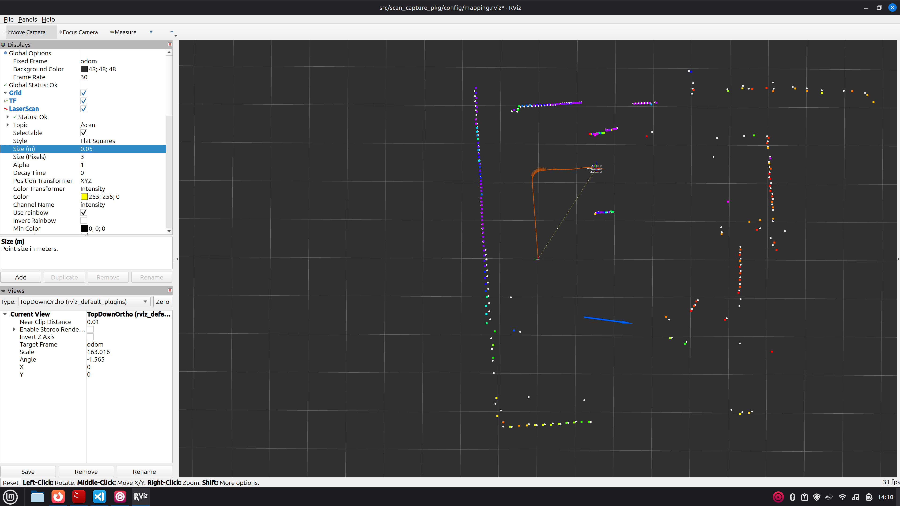
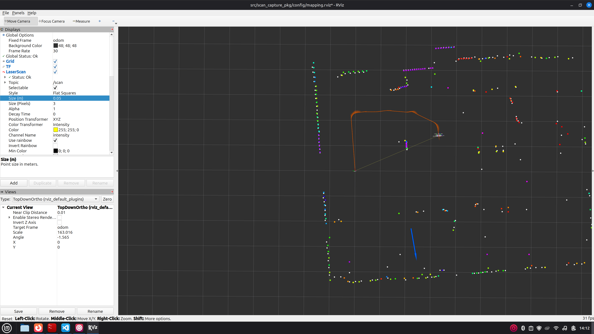
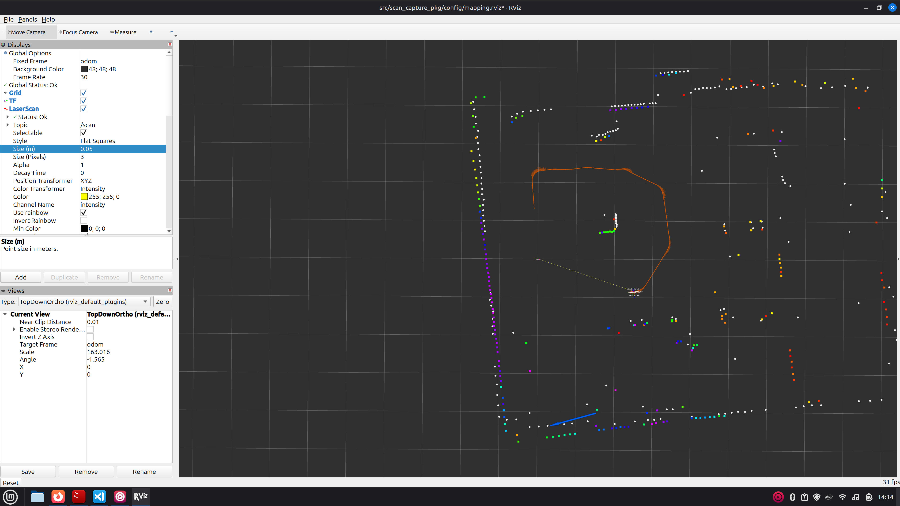
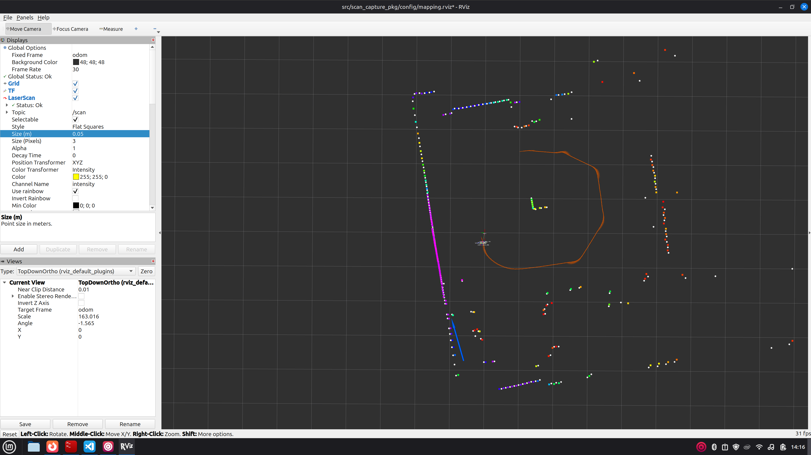
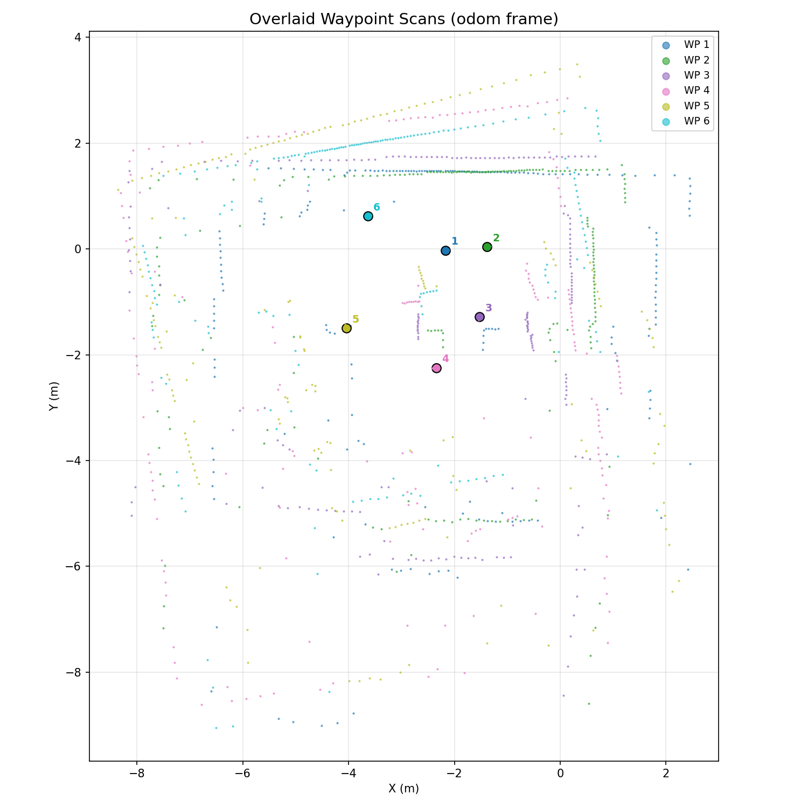

# Project 6: Naive Mapping by Waypoints

**EE5531 Introduction to Robotics**

**Team Members:** Anders Smitterberg, Victor Ameh

**Data collection date:** 2026-03-14

---

## 1. Navigation Strategy Summary (5 pts)

### Environment Description

The environment is a lab EERC 727 with a recycling bin placed in the center. The north wall runs along the top of the room, and a door is located in the east wall. The robot circled the recycling bin clockwise across five waypoints, then returned to the starting position for a sixth capture to check loop closure drift. From each waypoint the LDS has a clear line of sight to the north wall, the east door, and one corner of the recycling bin. At each waypoint, after taking the RViz screenshot and calling the scan capture service, a Leica laser rangefinder was used to measure the distance to the nearest visible corner of the recycling bin as the ground truth along with the shortest distance to the door and north wall.

### Environment Sketch


### Waypoint Summary

The robot circled the recycling bin clockwise across five waypoints, then returned to the start position where a sixth capture was taken for loop closure check. At each stop the procedure was: (1) take an RViz screenshot, (2) call the scan capture service, then (3) walk over and measure the distance to the nearest visible corner of the bin with the Leica laser rangefinder in addition to the walls. Poses are in the odometry frame (captured 2026-03-14).

| Capture | Odom X (m) | Odom Y (m) | Yaw (°) | Approx. Heading | Notes                        |
|---------|------------|------------|---------|-----------------|------------------------------|
| WP 1    | −2.167     | −0.025     |  +1     | East            | Start position               |
| WP 2    | −1.382     | +0.043     |  +3     | East            |                              |
| WP 3    | −1.525     | −1.283     | −97     | South           |                              |
| WP 4    | −2.345     | −2.246     | −170    | West            |                              |
| WP 5    | −4.041     | −1.500     | +105    | North           |                              |
| WP 6    | −3.637     | +0.618     |  +16    | East            | Return to start (loop closure) |

For the full written strategy see [`docs/navigation_strategy.md`](docs/navigation_strategy.md).

---

## 2. System Architecture (5 pts)

### Data Flow Diagram

Bag file records `/scan`, `/odom`, `/imu`, `/localization/pose`, and `/scan_capture/pointcloud` for replay and analysis.

### EKF Configuration Summary

The EKF node (launched via `scan_capture_pkg/launch/localization.launch.py`) fuses:

| Source | Topic | Signals |
|--------|-------|---------|
| Wheel odometry | `/joint_states` | Linear velocity (x), angular velocity (z) |
| IMU | `/imu` | Angular velocity (z), linear acceleration |

The filter publishes a `geometry_msgs/PoseStamped` to `/localization/pose` at the scan frame. If the localization node is unavailable, `scan_capture_node` automatically falls back to raw odometry from `/odom` as per the assignment instructions.

### Project 5 Sensor Characterization Integration

If we were to integrate the model from Project 5 we would do it as follows. We determined that the performance of the LDS could be characterized by a gaussian distribution, and that the variance of that distribution increased approximately linearly with the distance of the measurement.

This could be used to asign a probability of a real object being at the location of each one of the measured points. This information could be used to better, and more accurately determine wether a return is actually an obstacle, or if it is sinply sensor noise before commiting it to the map. 

---

## 3. Map Accuracy Results (15 pts)

### Distance Accuracy Table

RViz measurements were taken using the Measure tool after replaying the bag file with all captures visible simultaneously. Leica ground truth was measured immediately after each scan capture during the run. Three landmarks were measured at every waypoint: the **nearest visible corner of the recycling bin**, the **north wall**, and the **east door**.

#### Recycling Bin Corner

| Waypoint | Heading | Leica (m) | RViz (m) | Error (m) | Error (%) |
|----------|---------|-----------|----------|-----------|-----------|
| 1        | East    |           |          |           |           |
| 2        | East    |           |          |           |           |
| 3        | South   |           |          |           |           |
| 4        | West    |           |          |           |           |
| 5        | North   |           |          |           |           |
| **Mean** |         |           |          |           |           |
| **Max**  |         |           |          |           |           |

#### North Wall

| Waypoint | Heading | Leica (m) | RViz (m) | Error (m) | Error (%) |
|----------|---------|-----------|----------|-----------|-----------|
| 1        | East    |           |          |           |           |
| 2        | East    |           |          |           |           |
| 3        | South   |           |          |           |           |
| 4        | West    |           |          |           |           |
| 5        | North   |           |          |           |           |
| **Mean** |         |           |          |           |           |
| **Max**  |         |           |          |           |           |

#### East Door

| Waypoint | Heading | Leica (m) | RViz (m) | Error (m) | Error (%) |
|----------|---------|-----------|----------|-----------|-----------|
| 1        | East    |           |          |           |           |
| 2        | East    |           |          |           |           |
| 3        | South   |           |          |           |           |
| 4        | West    |           |          |           |           |
| 5        | North   |           |          |           |           |
| **Mean** |         |           |          |           |           |
| **Max**  |         |           |          |           |           |

**Loop closure check** — capture 6 is taken at the start position. Comparing its measurements to WP 1 reveals accumulated odometry drift over the full circuit.

| | Leica Bin (m) | RViz Bin (m) | Leica N-Wall (m) | RViz N-Wall (m) | Leica Door (m) | RViz Door (m) | Drift (m) |
|---|---------------|--------------|------------------|-----------------|----------------|---------------|-----------|
| WP 1 (start)       | | | | | | | — |
| Capture 6 (return) | | | | | | |   |

### Orientation Assessment

At each waypoint the robot should see: the **north wall** behind/to the side, the **east door** to the east, and the **recycling bin corner** in the expected direction. Misalignment is noted where the observed point cloud deviates from these expectations.

**Waypoint 1** (yaw approx. +1°, facing east):
- Expected: north wall to the left (north), east door ahead-right, bin corner to the south-west
- Observed in map:
- Rotational misalignment:

**Waypoint 2** (yaw approx. +3°, facing east):
- Expected: north wall to the left (north), east door ahead, bin corner to the south-west
- Observed in map:
- Rotational misalignment:

**Waypoint 3** (yaw approx. −97°, facing south):
- Expected: north wall behind, east door to the left, bin corner to the north-west
- Observed in map:
- Rotational misalignment:

**Waypoint 4** (yaw approx. −170°, facing west):
- Expected: north wall to the right, east door to the right-rear, bin corner ahead-right (north)
- Observed in map:
- Rotational misalignment:

**Waypoint 5** (yaw approx. +105°, facing north):
- Expected: north wall ahead, east door to the right, bin corner to the right (east)
- Observed in map:
- Rotational misalignment:

**Loop closure capture (capture 6, return to start)** (yaw approx. +16°, facing east):
- Expected: same view as WP 1 — north wall to the left, east door ahead-right, bin corner to the south-west
- Scan alignment with WP 1 in map:
- Rotational offset relative to WP 1:

### RViz Screenshots

**Individual scan captures at each waypoint:**

| Capture | Screenshot |
|---------|------------|
| WP 1    |  |
| WP 2    |  |
| WP 3    |  |
| WP 4    |  |
| WP 5    |  |
| WP 6 (loop closure) |  |

**Overall map with all scans visualized:**



**Measurement tool usage:**

*(add screenshots to `figures/map_evaluation/` showing the RViz Measure tool for at least two representative waypoints)*

---

## 4. Discussion (10 pts)

### Mapping Accuracy Analysis


### Sources of Error

- **Localization drift:** The EKF fuses odometry and IMU but cannot correct for accumulated drift without loop closure or external reference. Over the 5-waypoint circuit, any unobservable wheel slip or IMU bias compounds, shifting later scan placements in the odom frame. The loop closure capture (WP 6) quantifies this accumulated drift directly.
- **Measurement uncertainty:** Physical tape-measure readings have an estimated uncertainty of ± ___ m (straight-line measurement to a surface). LiDAR range noise (±30 mm typical for LDS-01) contributes additional uncertainty to RViz measurements.
- **Sensor limitations:** The LDS-01/02 returns sparse range rings at low angular resolution near 0° and 360°. Glass or reflective surfaces in the environment may produce spurious returns or max-range drop-outs.

### Map Consistency Assessment


### Recommendations for Improvement


---

## 5. Usage Instructions (5 pts)

### Clone and Build

This repository is the `src/` directory of a colcon workspace. Set it up like this:

```bash
mkdir -p proj6_ws
cd proj6_ws
git clone https://github.com/Robust-Autonomous-Systems-Laboratory/proj6_group3 src
source /opt/ros/jazzy/setup.bash
colcon build
```

### Terminal Setup (every new terminal)

```bash
source /opt/ros/jazzy/setup.bash
source src/turtlebot_connect.sh
source install/setup.bash
```

`turtlebot_connect.sh` sets `TURTLEBOT3_MODEL=burger`, `RMW_IMPLEMENTATION=rmw_fastrtps_cpp`, and `ROS_DOMAIN_ID=7`.

### Launch the TurtleBot3 Bringup

On the robot (SSH):
```bash
source /opt/ros/jazzy/setup.bash
source turtlebot_connect.sh
ros2 launch turtlebot3_bringup robot.launch.py
```

### Launch Localization Node

Runs the EKF, fusing wheel encoders (`/joint_states`) and IMU (`/imu`).
Publishes pose to `/localization/pose` and path to `/localization/path`.

```bash
ros2 launch scan_capture_pkg localization.launch.py
```

If localization is unavailable, `scan_capture_node` automatically falls back to raw odometry from `/odom` directly fron the Turtlebot.
### Teleoperate the Robot

```bash
ros2 run turtlebot3_teleop teleop_keyboard
```

### Run the Scan Capture System

```bash
# Default — saves to data/captures/, reads pose from /localization/pose
ros2 launch scan_capture_pkg scan_capture.launch.py

# Override output directory
ros2 launch scan_capture_pkg scan_capture.launch.py output_dir:=/tmp/my_captures
```

### Capture Scans at Waypoints

**Keyboard interface**:
```bash
ros2 run scan_capture_pkg keyboard_capture.py
# 1–9 : capture with that waypoint ID
# s   : capture with auto-incrementing ID
# q   : quit
```

**Manual service call**:
```bash
ros2 service call /scan_capture/capture scan_capture_pkg/srv/CaptureScan \
  "{waypoint_id: 1, description: 'north_wall'}"
```

Each successful capture writes two files to `data/captures/`:
- `wp_01_<timestamp>.yaml` — pose (x, y, yaw) and scan metadata
- `wp_01_<timestamp>.npy`  — raw range array (float32)

### Record a Bag File

```bash
ros2 bag record -o data/mapping_run \
  /scan /odom /imu /localization/pose /scan_capture/pointcloud
```

### Visualize the Captured Map

```bash
# Open RViz with provided config
rviz2 -d src/scan_capture_pkg/config/mapping.rviz

# Or replay a recorded bag (keeps all scan captures visible in RViz)
ros2 bag play data/mapping_run --clock
```

In RViz, set the `/scan_capture/pointcloud` display history depth to at least the number of waypoints.

---

## 6. Acknowledgements
